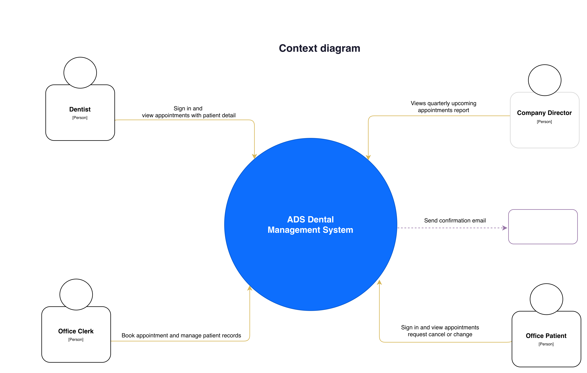
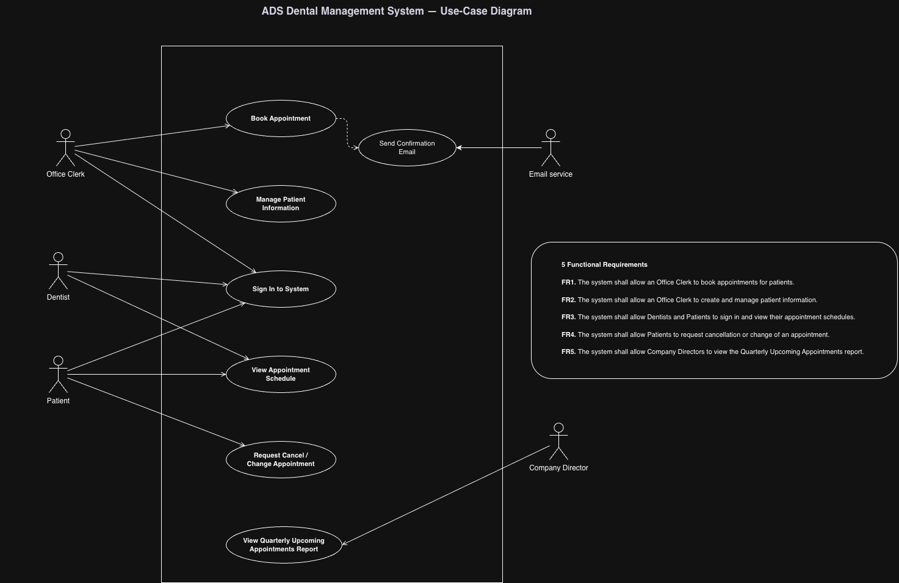
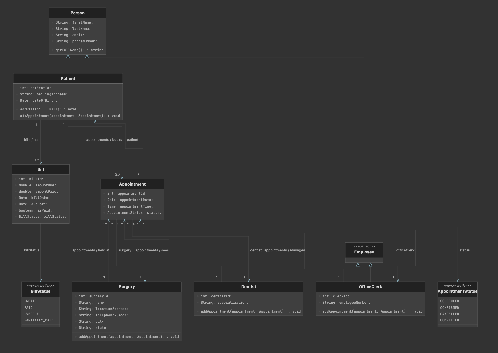

# ADS Dental Management System

## Diagrams

### Context Diagram



### Use Case Diagram



### Class Diagram



## Requirements

- **Java 21** (JDK or JRE)
- **Maven 3.9+** (for building and running via Maven)

## Run the Application

From the project root directory:

```bash
mvn exec:java
```

Alternatively, build a runnable JAR and run it:

```bash
mvn clean package
java -jar target/MidTerm-1.0-SNAPSHOT.jar
```

## Docker

The application is packaged as a multi-stage Docker image (Maven 21 build, Eclipse Temurin 21 JRE runtime).

**Image:** `tuguldurdev/miu-swe-midterm`

### Pull and run

```bash
docker pull tuguldurdev/miu-swe-midterm
docker run --rm tuguldurdev/miu-swe-midterm
```

### Build and run locally

From the project root directory:

```bash
docker build -t tuguldurdev/miu-swe-midterm .
docker run --rm tuguldurdev/miu-swe-midterm
```

### Push to Docker Hub

```bash
docker login
docker push tuguldurdev/miu-swe-midterm
```
